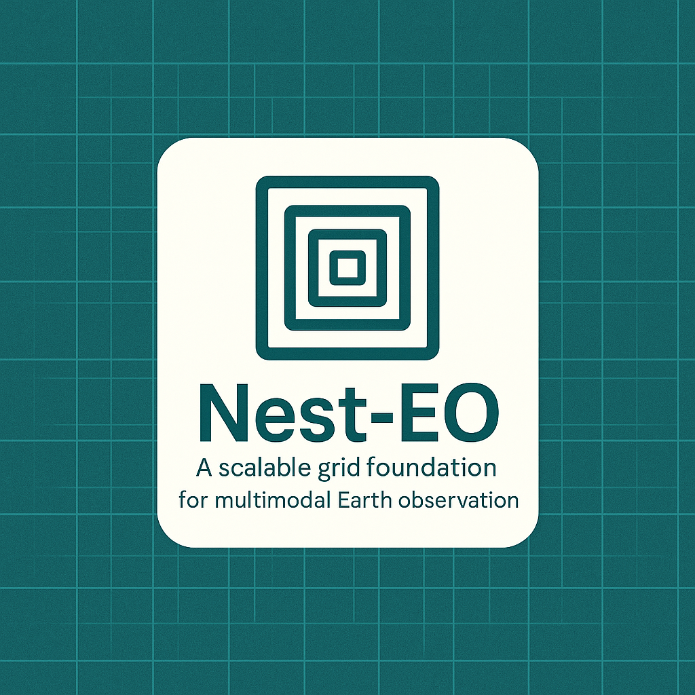

# NestEO
NestEO: Nested and Aligned Earth Observation Framework with Multimodal Dataset  
  
Hierarchical, Extensible , Nested, Aligned, Representative, Contextual, Multimodal, Earth Observation (Framework & Dataset)

NestEO is a Hierarchical, Extensible, and Nested framework built on a  defined global grid structure, designed to support an Aligned, Representative, and Contextual dataset architecture for Multimodal Earth Observation. It supports balanced sampling across land cover types, climate zones and human-environmental gradients, while maintaining modular compatibility with multimodal EO sources such as Sentinels, SAR, common medium and high-resolution sources and auxiliary datasets. The framework prioritizes metadata integrity, cross-resolution alignment, and AI-readiness for scalable applications in environmental monitoring, land cover modeling, and geospatial foundation model training.

Dataset will be available at: https://huggingface.co/nesteo-datasets