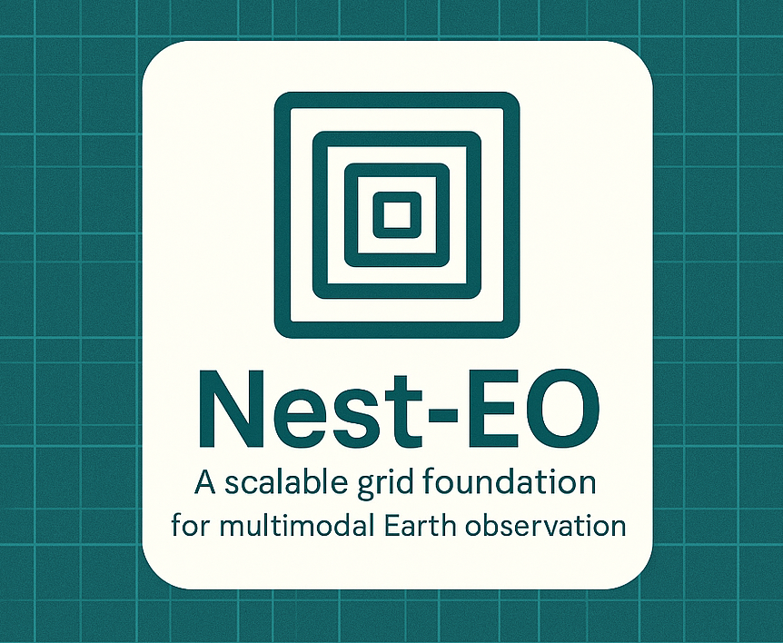

# NestEO
NestEO: Nested and Aligned Earth Observation Framework with Multimodal Dataset  
  
Hierarchical, Extensible , Nested, Aligned, Representative, Contextual, Multimodal, Earth Observation (Framework & Dataset)

# NestEO
**Nested and Aligned Earth Observation Framework with Multimodal Dataset**

NestEO is a hierarchical, modular, and extensible framework for curating general-purpose Earth Observation (EO) datasets using a spatially nested, UTM- and polar-aligned grid system. NestEO is designed to support an Aligned, Representative, and Contextual dataset architecture for Multimodal Earth Observation. It supports balanced sampling across land cover types, climate zones and human-environmental gradients, while maintaining modular compatibility with multimodal EO sources such as Sentinels, SAR, common medium and high-resolution sources and auxiliary datasets. The framework prioritizes metadata integrity, cross-resolution alignment, and AI-readiness for scalable applications in environmental monitoring, land cover modeling, and geospatial foundation model training.

This repository provides the prototype implementation for the NestEO framework including:

- Multi-resolution, UTM-aligned grid generation (`150m` to `120km`)
- CRS-aware `GeoParquet` grid tiles and spatial row-grouping
- Landcover-informed metadata filtering and subset selections (ESA WorldCover)
- Tile indexing and nesting for scalable, multi-source pairing
- Sample ingestion pipelines for Sentinel-2, Sentinel-3, SAR, Wyvren, and Satellogic
- Structured directory schema for future large-scale expansion

---

## 🔍 What Does NestEO Enable?

- **Aligned Sampling Across Grid Level and EO Resolutions** — From 150m to 120km, tiles are fully nested and buffered to match common EO imagery specs.
- **Semantic Diversity-Aware Selection** — Metadata-enriched tiles support landcover-stratified, regionally-balanced sampling.
- **Multimodal Compatibility** — Designed for seamless ingestion and pairing of optical, SAR, hyperspectral, and atmospheric EO sources.
- **Foundation Model Grounding** — Enables training of cross-modal, multi-resolution, multi-level foundation models using tile-aligned representations.
- **FAIR-Aligned Architecture** — Grid-aware, queryable, and metadata-linked storage for scalable EO research and reuse.

---

## 📦 Prototype Dataset

The current prototype release demonstrates:
- Grid generation and structure
- Metadata integrity pipelines
- Sample EO tiles clipped to grid cells
- Cross-source pairings of sample EO sources on dates and grid cells

It serves as a reference snapshot of the framework implementation. A comprehensive **v1 release** is in progress, which will include:
- 12+ EO modalities
- 250,000+ globally distributed selected grid cells
- Paired subset samples across levels for multimodal learning
- Auxiliary layers and pretrained embedding support

> 🚧 Prototype available at: [Hugging Face – nesteo-prototype](https://huggingface.co/datasets/nesteo-datasets/nesteo-prototype)

> 🧭 Full v1 release coming soon: [Hugging Face – nesteo-v1](https://huggingface.co/datasets/nesteo-datasets/nesteo-v1)

---

## 📂 Repository Structure

Dataset will be available at: [https://huggingface.co/nesteo-datasets](https://huggingface.co/nesteo-datasets)
